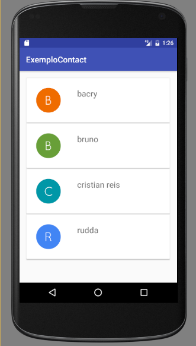
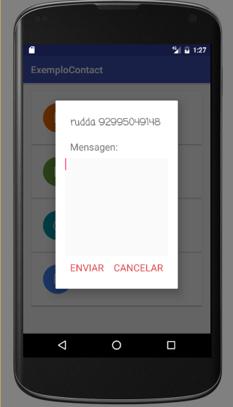

# minicurso-android-SNCT16
Projeto do minicurso de android +material designer da Semana Nacional de Ciencia e Tecnlogia do Instituto de Ciencias Exatas e Tecnologia ICET - UFAM.

Este projeto consiste em um lista de contatos do dispositivo agrupados em cardViews (Material Designer).
Ele tambem permite o envio de sms para um contato selecionado da lista.

# ScreenShots

 

# Tutorial do minicurso 

O passo-a-passo para construção do projeto está disponivel na pasta recursos.
<a href= "https://github.com/rudda/minicurso-android-SNCT16/tree/master/recursos/tutorial"> link do tutorial </a>

